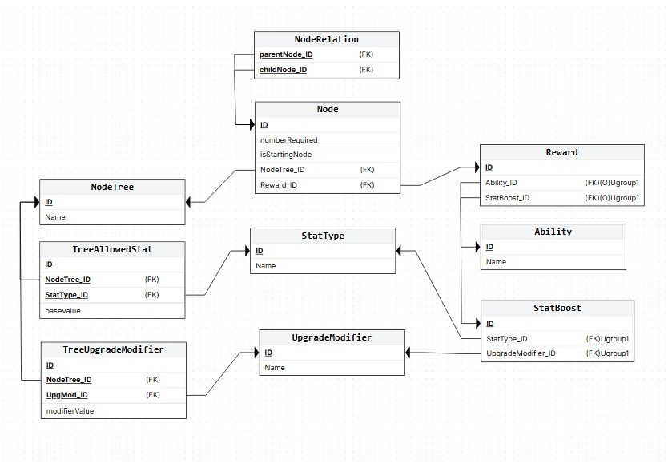

# Upgrade Trees Easy Handler (UTEH)

**UTEH** is a software developed to simplify the implementation of Upgrade Trees for different games or any other purpose the user chooses. 

## Usage

> [!TIP]
> To quickly reset the database, load from csv before the project folder is created.

The database implementation follows the next table schema:

<picture>
    
</picture>

 

Here's an explanation of every entity each identified by an ID:\

> [!NOTE]
> The definitions are more like a suggestion as the software can be used in a different way that intended.

### **Node Tree**
Holds the *name* of the upgrade tree to add nodes and the rest of elements.\
Where:
- *Name*: Holds the name to identify the Node Tree.

**Table representation:**\
` ID | NAME `

**Example:**\
` TREE-1 | MAGE CLASS `

### **Ability**
Holds the name of the Ability.\
Where:
- *Name*: Name of the ability that the player will receive.

**Table representation:**\
` ID | NAME `

**Example:**\
` ABILITY-1 | FIREBALL `

### **Stat Type**
Holds the name of the Stat Type.\
Where:
- *Name*: Name of the Stat Type.

**Table representation:**\
` ID | NAME `

**Example:**\
` STAT-1 | HEALTH `

### **Upgrade Modifier**
Holds the tags for possible stat modifications. How much impact the upgrade will have.\
Where:
- *Name*: Name of the referred Upgrade Modifier tag. (e.g: Low, Medium, High)

**Table representation:**\
` ID | NAME `

**Example:**\
` STAT-1 | LOW `

### **Stat Boost**
Holds relation between each Stat Type and the Upgrade Modifier.\
Where:
- *StatType_ID*: ID of the referred Stat Type.
- *UpgradeModifier_ID*: ID of the referred Upgrade Modifier.

**Table representation:**\
` ID | STAT TYPE ID | UPGRADE MODIFIER ID `

**Example:**\
` STATBOOST-1 | STAT-1 | UPGMOD-1 `

### **Reward**
Represents the Reward given to the player after obtaining the Node that it is related to. Ability and StatBoost must be a unique pair.\
Where:
- *Ability_ID*: Ability obtained after obtaining the Node.
- *StatBoost_ID*: Stat Boost obtained after obtaining the Node.

Both can be Null, so the Reward is empty.

**Table representation:**\
` ID | ABILITY ID | STAT BOOST ID `

**Example:**\
` RWD-1 | ABILITY-1 | STATBOOST-1 `

### **Node**
Represents each Node that is assigned to a Upgrade Tree.\
Where:
- *numberRequired*: Required number of elements to unlock the node.
     (e.g. needing 15 xp to unlock the next Node).
- *isStartingNode*: If the Node is a starting node of the assigned tree.
     Defaults to 0.
- *NodeTree_ID*: Related Node Tree identified by ID.
- *Reward_ID*: Reward obtained after unlocking the Node.

**Table representation:**\
` ID | NUMBER REQUIRED | IS STARTING NODE | NODE TREE ID | REWARD ID `

**Example:**\
` NODE-1 | 0 | 1 | TREE-1 | RWD-1 `

### **Node Relation**
Relates the *parent* and *child* relation between two Nodes. Needs at least two Nodes created to create a Node Relation\
Where:
- *parentNode_ID*: Parent of the *Child Node*.
- *childNode_ID*: Child of the *Parent Node*.

**Table representation:**\
` ID | PARENT NODE ID | CHILD NODE ID `

**Example:**\
` NDRELATION-1 | NODE-1 | NODE-2 `

### **Tree Allowed Stat**
Represents if the tree can hold the stat type or not.\
Where:
- *NodeTree_ID*: ID of the assigned Node Tree.
- *StatType_ID*: ID of the assigned Stat Type.
- *baseValue*: Default number that the node gives after obtaining it.

**Table representation:**\
` ID | NODE TREE ID | STAT TYPE ID | BASE VALUE `

**Example:**\
` TREESTAT-1 | TREE-1 | STAT-1 | 10.0 `

***Using the names referred in the default data:***\
` TREESTAT-1 | MAGE CLASS | HEALTH | 10.0`

So every time the player obtains a Reward that holds health, it will add 10.0 to it by default.

### **Tree Upgrade Modifier**
Relates the tree and the tag of the Upgrade Modifier.\
Where:
- *NodeTree_ID*: ID of the assigned Node Tree.
- *UpgMod_ID*: ID of the assigned Upgrade Modifier.
- *modifierValue*: Number that will alter the baseValue.

**Table representation:**\
` ID | NODE TREE ID | UPGRADE MODIFIER ID | BASE VALUE `

**Example:**\
` TREESTAT-1 | TREE-1 | UPGMOD-1 | 0.5 `

***Using the names assigned in the default data:***\
` TREESTAT-1 | MAGE CLASS | LOW | 0.5 `

So every time the player obtains a Reward that holds a LOW modifier it will multiply the baseValue of the Stat Type by 0.5.

## Future development

- [ ] Implementation of JSON loading/saving.
- [ ] More of a graphic interface to CRUD (Create Read Update Delete) the Nodes and Node Relations.