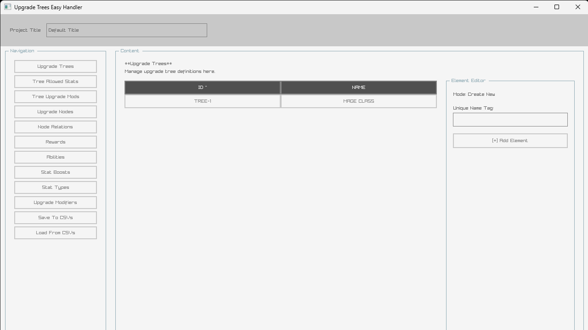
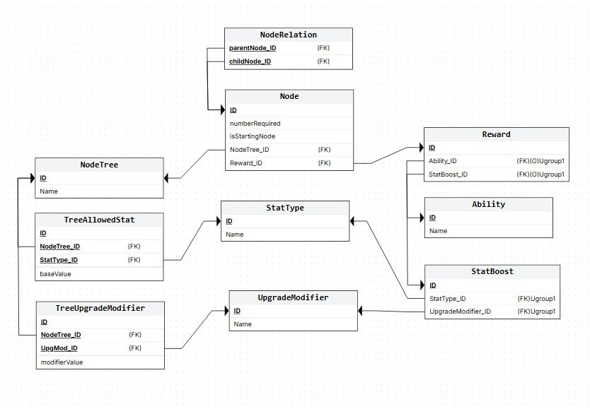

# UTEH — Upgrade Trees Easy Handler


**UTEH** is a desktop tool for designing and managing **upgrade / skill trees** for games or any other project that applies this progression system. It gives you a simple GUI to define trees, nodes, abilities, stat boosts and their relationships, and to persist everything as CSV data.

Built with Python and [raylib](https://www.raylib.com/) for the GUI.



## Download
 
For the users. Grab the latest ready-to-run build from the **[Releases page](https://github.com/fallingPilot/UTEH/releases/latest)**:
 
| Platform | File | Notes |
|----------|------|-------|
| 🪟 Windows | `UTEH-W11.exe` | Download and run — no installation needed. |
| 🐧 Linux | `UTEH-Linux.bin` | Download, then mark it as executable: `chmod +x UTEH-Linux.bin`, then run it with `./UTEH-Linux.bin`. |
 
If you want a specific older version instead, check the full [releases history](https://github.com/fallingPilot/UTEH/releases).
 
> Want to run it from source or contribute to the code instead? See [Installation](#installation) below.

## Table of Contents

- [Features](#features)
- [Requirements](#requirements)
- [Installation](#installation)
- [Usage](#usage)
- [Data Model](#data-model)
- [Roadmap](#roadmap)
- [Contributing](#contributing)
- [License](#license)

## Features

- Visual editor for upgrade trees, nodes, and node relations (parent/child).
- Define abilities, stat types, stat boosts, and rewards independently and combine them freely.
- Configure per-tree base values and upgrade modifiers (e.g. Low / Medium / High multipliers).
- Save and load your project as CSV files, so the data is easy to inspect, version, or import elsewhere.

## Requirements

*(only needed if running from source — see [Download](#download) for the ready-to-run version)*
 
- Python 3.14.x
- csv-manager
- [raylib](https://pypi.org/project/raylib/) Python bindings

## Installation

```bash
git clone https://github.com/fallingPilot/UTEH.git
cd UTEH
pip install -r requirements.txt
```

## Usage

Run the app from the project root:

```bash
python main.py
```

This opens the main window (screenshot above), where you can:

1. Use the **Navigation** panel on the left to switch between entity types (Upgrade Trees, Nodes, Abilities, Stat Boosts, etc.).
2. Select an entity from the table in the **Content** panel to view or edit it.
3. Use the **Element Editor** panel on the right to create a new entity — fill in the fields and click **Add Element**.
4. Use **Save to CSVs** / **Load from CSVs** to persist or reload your project data.

> [!TIP]
> To quickly reset the database, load from csv before the project folder is created.

## Data Model

UTEH is built around a relational schema. The core idea: a **Node Tree** contains **Nodes**, each Node can require unlocking (e.g. via XP), can be a starting node, and grants a **Reward** — which in turn can bundle an **Ability** and/or a **Stat Boost**. **Node Relations** link nodes as parent/child to define the tree's shape, and **Tree Allowed Stats** / **Tree Upgrade Modifiers** control which stats a tree can grant and how upgrade tiers scale those values.



<details>
<summary>Full entity reference (click to expand)</summary>

> [!NOTE]
> The definitions are more like a suggestion as the software can be used in a different way that intended.

### Node Tree
Holds the *name* of the upgrade tree to which nodes and other elements are added.

` ID | NAME `

**Example:**\
` TREE-1 | MAGE CLASS `

### Ability
Holds the name of the ability the player receives.

` ID | NAME `

**Example:**\
` ABILITY-1 | FIREBALL `

### Stat Type
Holds the name of a stat type.

` ID | NAME `

**Example:**\
` STAT-1 | HEALTH `

### Upgrade Modifier
Holds tags for possible stat modifications — how much impact an upgrade has (e.g. Low, Medium, High).

` ID | NAME `

**Example:**\
` UPGMOD-1 | LOW `

### **Stat Boost**
Relates a Stat Type to an Upgrade Modifier.

` ID | STAT TYPE ID | UPGRADE MODIFIER ID `

**Example:**\
` STATBOOST-1 | STAT-1 | UPGMOD-1 `

### Reward
Represents what the player gets after unlocking a Node. `Ability_ID` and `StatBoost_ID` must form a unique pair, and both can be `NULL` for an empty reward.

` ID | ABILITY ID | STAT BOOST ID `

**Example:**\
` RWD-1 | ABILITY-1 | STATBOOST-1 `

### **Node**
Represents a single node in an Upgrade Tree.

- `numberRequired`: amount needed to unlock the node (e.g. 15 XP).
- `isStartingNode`: whether this is a starting node (defaults to 0).
- `NodeTree_ID`: the tree this node belongs to.
- `Reward_ID`: the reward granted when unlocked.

` ID | NUMBER REQUIRED | IS STARTING NODE | NODE TREE ID | REWARD ID `

**Example:**\
` NODE-1 | 0 | 1 | TREE-1 | RWD-1 `

### Node Relation
Defines a parent/child relationship between two Nodes (requires at least two existing Nodes).

` ID | PARENT NODE ID | CHILD NODE ID `

**Example:**\
` NDRELATION-1 | NODE-1 | NODE-2 `

### Tree Allowed Stat
Defines whether a tree can hold a given stat type, and the default (`baseValue`) it grants.

` ID | NODE TREE ID | STAT TYPE ID | BASE VALUE `

**Example:**\
` TREESTAT-1 | TREE-1 | STAT-1 | 10.0 `

***Using the values referred in the default data:***\
` TREESTAT-1 | MAGE CLASS | HEALTH | 10.0 ` → Every reward that grants Health on this tree adds 10.0 by default.

### Tree Upgrade Modifier
Relates a tree to an Upgrade Modifier tag and defines how much it alters the base value.

**Table representation:**\
` ID | NODE TREE ID | UPGRADE MODIFIER ID | BASE VALUE `

**Example:**\
` TREESTAT-1 | TREE-1 | UPGMOD-1 | 0.5 `

***Using the values referred in the default data:***\
` TREESTAT-1 | MAGE CLASS | LOW | 0.5 ` → Every reward with a LOW modifier multiplies the stat's base value by 0.5.

> Note: these definitions are a suggestion — the schema is flexible enough to be used differently depending on your project.

</details>

## Roadmap

- [ ] JSON loading/saving support.
- [ ] Richer GUI for CRUD (Create, Read, Update, Delete) operations on Nodes and Node Relations.

## Contributing

Issues and pull requests are welcome. If you plan a larger change, please open an issue first to discuss what you'd like to change.

## License

Distributed under the [GPL-3.0 License](LICENSE).
